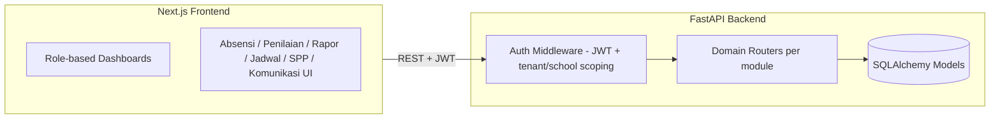
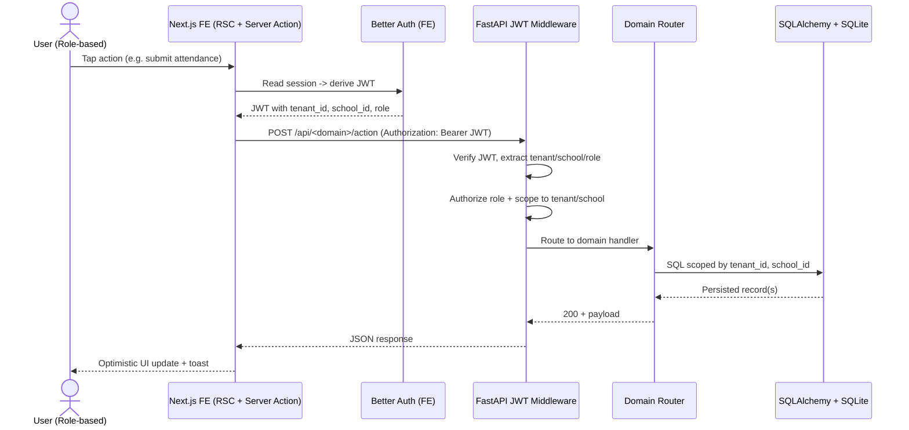
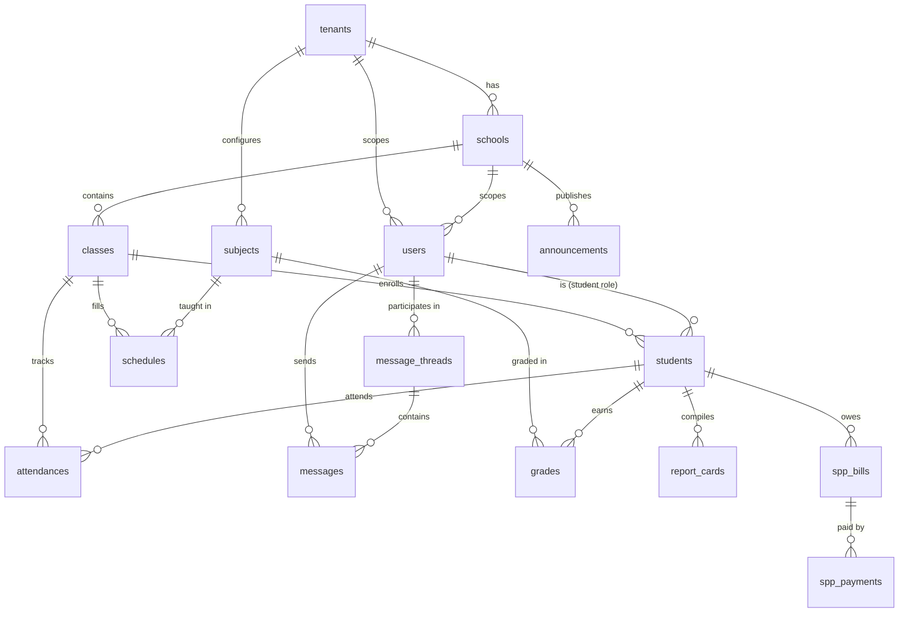

# PRD: School Management System (SMS)

## Overview

The School Management System is a web-based, modular platform that digitizes the day-to-day administration of Indonesian K-12 schools (TK through SMA), replacing paper-based attendance, grading, scheduling, and payment tracking with a single connected system. It is built around a per-jenjang tenancy model — each education level (TK, SD, SMP, SMA) operates as its own isolated tenant with its own kurikulum rules, grade scale, and configuration — so a Yayasan running multiple schools across multiple levels can coordinate centrally while each jenjang keeps rules appropriate to its students (TK uses narrative tumbuh kembang assessments, SD/SMP/SMA follow Kurikulum Merdeka with fase-based rapor formats, and SMA adds penjurusan). The system covers the full MVP scope in one release: master data management, absensi (attendance), penilaian (grading) flowing into rapor (report cards), jadwal (class scheduling), SPP (tuition billing and payment tracking), and a parent-school communication channel, all served through six role-based dashboards (Kepala Sekolah, Guru, Siswa, Orang Tua, Tata Usaha, Yayasan) so each user lands on a home screen built around what they actually need to do that day. The architecture is deliberately modular so a future University tenant type — with its own grading scale (A/B/C/D), SKS credit system, and semester structure — can be added without disrupting existing K-12 tenants.

## Target Users

- **Kepala Sekolah (Principal)** — oversees one school, needs school-wide visibility into attendance, grades, SPP collection, and staff activity.
- **Guru (Teacher, incl. Wali Kelas)** — takes daily attendance, inputs grades, views own teaching schedule; Wali Kelas additionally manages homeroom rapor compilation.
- **Siswa (Student)** — views own schedule, attendance record, grades, and published rapor.
- **Orang Tua (Parent)** — views child's attendance, grades, rapor, SPP bill status, and receives school announcements/messages.
- **Tata Usaha (TU / Admin Staff)** — manages master data, generates SPP bills, records payments, handles day-to-day administrative operations.
- **Yayasan (Foundation / Super-admin)** — oversees multiple schools across multiple jenjang, creates tenants and schools, assigns admins, views cross-school reporting.

## Requirements

### Master Data
- Yayasan can create jenjang tenants (TK/SD/SMP/SMA) and register schools under each tenant.
- TU/Principal can manage students, classes, subjects, teachers, and parent accounts within their school.
- Class records support grade level, wali kelas assignment, and jenjang-specific rules (e.g. SMA penjurusan).
- Subjects are jenjang-aware — TK uses "aspek tumbuh kembang" categories instead of formal subjects.
- Parent-student linking supports one parent to many children and many parents (guardians) to one student.

### Absensi (Attendance)
- Guru records daily attendance per class per session with status: hadir/izin/sakit/alpa.
- Wali Kelas can view and correct attendance for their homeroom class.
- Attendance record automatically triggers a notification to the linked orang tua.
- Attendance summary rolls up to monthly/semester recap for rapor input.

### Penilaian (Grade Book)
- Guru inputs grades per subject, per student, categorized as formatif/sumatif/PR/Tugas.
- Score range 0-100 with optional descriptive note (required for TK/SD narrative components).
- Grades are scoped per semester and tied to the active kurikulum version of the tenant.
- Wali Kelas can view aggregated grades across all subjects for students in their class.

### Rapor (Report Card)
- System compiles rapor per student per semester from attendance + grade data.
- Rapor format follows Kurikulum Merdeka fase structure; TK/SD use narrative descriptive text, SMP/SMA use numeric score plus description.
- Rapor has draft/published state; only published rapor is visible to orang tua and siswa.
- Wali Kelas reviews and finalizes rapor before principal sign-off and publish.

### Jadwal Pelajaran (Schedule)
- TU/Principal configures weekly class schedule (day, period, subject, teacher).
- Guru sees own teaching schedule, filtered to today by default.
- Siswa/Orang Tua see class schedule, filtered to today by default.
- Schedule changes (e.g. substitute teacher) reflect immediately to affected roles.

### SPP / Tuition Billing
- TU generates SPP bills per student per billing period with amount and due date.
- Bill status tracked as unpaid/paid/overdue, with automatic overdue flagging past due date.
- TU records payments against a bill (method, amount, receipt number, paid date).
- Orang Tua views own child's bill history and current status; overdue bills trigger notification.

### Komunikasi (Parent-Teacher Communication)
- School staff (principal/TU/guru) can post announcements scoped to an audience (all, one class, one jenjang).
- Orang Tua and Guru can open 1-1 message threads for direct communication.
- Announcements and messages are tenant/school scoped — no cross-school visibility except for Yayasan.

### Dashboard (Role-based)
- Each of the 6 roles has a distinct home screen with role-specific widgets on login.
- Kepala Sekolah: school health overview (attendance rate, grade completion, SPP collection rate).
- Guru: today's classes, pending grade entries, attendance-taken status.
- Siswa: today's schedule, recent grades, published rapor status.
- Orang Tua: child's attendance/grade summary, SPP status, latest announcements.
- Tata Usaha: today's operational queue (bills to generate, payments to record, master data pending).
- Yayasan: multi-school/multi-tenant overview (enrollment, SPP collection, compliance status).

## Core Features

### Phase 1 — Web Application (MVP)
- Multi-tenant School Setup
- Master Data Management
- Role-based Dashboard
- Absensi / Attendance
- Penilaian / Grade Book
- Rapor / Report Card
- Jadwal Pelajaran
- SPP / Tuition Billing
- Parent-Teacher Communication
- Auth & Multi-tenancy Boundaries

### Phase 2 — Mobile companion (Future-Scoped)
- Flutter Mobile App (Orang Tua + Siswa on the go)
- Push notifications for absensi & rapor
- Offline-first draft rapor view

### Phase 3 — University Extension (Future-Scoped)
- SKS / semester system
- Different grade scale (A/B/C/D vs 0-100)
- KRS / jadwal kuliah workflow

## Architecture

The system is a monorepo with a Next.js 14+ App Router frontend and a FastAPI backend, connected over a JSON REST API secured by JWTs issued through Better Auth. The frontend handles routing, role-based layout switching, and M3-styled UI components; the backend owns all business logic, validation (Pydantic v2), and persistence (SQLAlchemy 2.0 + Alembic migrations, SQLite in dev with a Postgres-compatible schema for production). Multi-tenancy is enforced at the API layer: every request carries a JWT claim resolving to `tenant_id` (the jenjang instance) and, where applicable, `school_id`; every query is scoped by these IDs except for the Yayasan/super_admin role, which is granted cross-tenant read access. Each jenjang tenant is logically isolated — its kurikulum config, grade rules, and subject/rapor structure are independent of other tenants — which is what allows a University tenant type to be added later as a new tenant kind without touching TK/SD/SMP/SMA logic.

The flow below illustrates how a request propagates through the stack for a role-protected mutation — from the user's tap, through Better Auth session check, into the FastAPI JWT verification middleware, into the domain router, and back. This is the canonical pattern every domain module (absensi, penilaian, rapor, jadwal, SPP, komunikasi) follows; the diagram is generic on purpose so each domain ticket can reference the same sequence and only vary the labels.

## Database Schema

The schema is partitioned along three boundaries: tenant hierarchy (`tenants`, `schools`), identity (`users` with role + scoped to tenant/school), and the operational domains (absensi, penilaian, rapor, jadwal, spp, komunikasi). The `tenant_id` column on every operational table is the hard isolation boundary — even if a query forgets to filter, row-level scoping in the API middleware enforces it. `report_cards.compiled_data` is a JSON blob whose shape depends on `tenants.kurikulum_version`, so Fase A/B/C/D rapor formats co-exist with the SMA numeric-with-descriptive format and a future University A/B/C/D scale without schema forks.

### Table Details

- **tenants** — id, name (TK/SD/SMP/SMA/University), jenjang_type, kurikulum_version, config (jsonb-like), created_at.
- **schools** — id, tenant_id (FK), name, address, principal_id (FK users), created_at.
- **users** — id, tenant_id (FK), school_id (FK, nullable for super_admin), email, hashed_auth_ref, role (enum: principal/teacher/student/parent/admin/super_admin), full_name, created_at.
- **students** — id, user_id (FK users), school_id (FK), class_id (FK classes), nis, birth_date, enrollment_status.
- **classes** — id, school_id (FK), name, grade_level, jurusan (nullable, SMA only), wali_kelas_id (FK users), academic_year.
- **subjects** — id, tenant_id (FK), name, category (formal subject or tumbuh_kembang aspect for TK), applicable_grade_levels.
- **schedules** — id, class_id (FK), subject_id (FK), teacher_id (FK users), day_of_week, period_number, start_time, end_time.
- **attendances** — id, student_id (FK), class_id (FK), date, status (enum: hadir/izin/sakit/alpa), recorded_by (FK users), note.
- **grades** — id, student_id (FK), subject_id (FK), semester, category (enum: formatif/sumatif/PR/tugas), score (0-100), description, recorded_by (FK users).
- **report_cards** — id, student_id (FK), semester, status (enum: draft/published), kurikulum_version, compiled_data (narrative or numeric per jenjang), finalized_by (FK users), published_at.
- **spp_bills** — id, student_id (FK), period, amount, due_date, status (enum: unpaid/paid/overdue), created_by (FK users).
- **spp_payments** — id, bill_id (FK), paid_at, method, amount, receipt_no, recorded_by (FK users).
- **announcements** — id, tenant_id (FK), school_id (FK, nullable), author_id (FK users), audience (enum: all/class/jenjang), title, body, published_at.
- **message_threads** — id, tenant_id (FK), school_id (FK), participant_ids (parent + teacher), subject, created_at.
- **messages** — id, thread_id (FK), sender_id (FK users), body, sent_at, read_at.

## Kurikulum Merdeka Compliance

Rapor format follows the Keputusan Mendikbud governing Kurikulum Merdeka fase structure: Fase A (SD grade 1-2), Fase B (SD grade 3-4), Fase C (SD grade 5-6), Fase D (SMP grade 7-9), Fase E/F (SMA grade 10-12). TK and SD rapor lean on narrative descriptive assessment (capaian pembelajaran described in prose per aspek), while SMP and SMA rapor combine numeric score (0-100) with a descriptive note per subject. `report_cards.kurikulum_version` and `report_cards.compiled_data` carry the fase-specific structure so rendering and validation differ per tenant without branching core logic.

## Modular Extensibility

The tenant model is the extension point. A University tenant type reuses the same `tenants`/`schools`/`users` backbone but swaps in a different grading scale (A/B/C/D instead of 0-100), a credit system (SKS) replacing fixed class-hour schedules, and a semester/term structure instead of the K-12 semester ganjil/genap split. Because `grades`, `schedules`, and `report_cards` are already scoped per `tenant_id` with tenant-level config driving score interpretation, adding University means adding a new `jenjang_type` and its config/rendering rules — not new tables or a schema migration of existing tenants.

## Tech Stack

- Frontend: Next.js 14+ App Router, TypeScript, Tailwind CSS, Material Design 3 tokens, Better Auth, lucide-react icons.
- Backend: FastAPI (Python 3.12), SQLAlchemy 2.0 + Alembic, Pydantic v2.
- Database: SQLite (dev), Postgres-compatible schema for production.
- Auth: Better Auth (frontend) + JWT verification (backend), tenant/school claims enforced per request.
- Tooling: pnpm (frontend), uv + pyproject.toml (backend), gh CLI (repo/project management).

## User Flows

### Flow 1: Parent views child's rapor
Orang Tua logs in, lands on parent dashboard showing child summary card, taps "Rapor," sees semester rapor (published only), reviews narrative/numeric assessment per subject, can download/print.

### Flow 2: Teacher inputs attendance
Guru logs in, lands on teacher dashboard showing today's classes, selects a class session, marks each student hadir/izin/sakit/alpa, submits; system notifies parents of izin/sakit/alpa students.

### Flow 3: Principal views school-wide dashboard
Kepala Sekolah logs in, lands on principal dashboard showing attendance rate today, grade-entry completion by teacher, SPP collection rate this month, and pending announcements to approve.

---

## Feature Specifications

## Feature: Multi-tenant School Setup

Yayasan creates jenjang tenants and schools under them, and assigns school-level admins.

## Specification

### Goal
Let Yayasan/super_admin bootstrap the tenant hierarchy (jenjang tenant to school to admin) so every downstream module has a valid tenant/school scope to operate in.

### Definition of Done
- [ ] Super_admin can create a tenant with jenjang_type and kurikulum_version.
- [ ] Super_admin can create a school under an existing tenant.
- [ ] Super_admin can assign a principal/TU admin user to a school.
- [ ] All created records are queryable by super_admin across tenants and correctly scoped for other roles.

## Sub-feature: Tenant Creation

### Goal
Allow super_admin to define a new jenjang tenant with its base config.

### Definition of Done
- [ ] Form/API to create tenant (name, jenjang_type, kurikulum_version).
- [ ] Validation rejects duplicate tenant name within same jenjang_type.
- [ ] Tenant appears in Yayasan multi-tenant overview immediately after creation.

## Sub-feature: School Registration

### Goal
Allow super_admin to register one or more schools under a tenant.

### Definition of Done
- [ ] Form/API to create school (name, address, tenant_id).
- [ ] School inherits tenant's kurikulum_version and jenjang rules by default.
- [ ] School list visible in Yayasan dashboard, grouped by tenant.

## Sub-feature: Admin Assignment

### Goal
Allow super_admin to assign a principal or TU user to a specific school.

### Definition of Done
- [ ] Super_admin can invite/assign existing user or create new user with role principal/admin scoped to a school.
- [ ] Assigned admin can log in and only sees their own school's data.
- [ ] Reassignment/removal of admin is supported and audit-logged.

---

## Feature: Master Data Management

CRUD for students, classes, subjects, teachers, and parents, scoped per role.

## Specification

### Goal
Give TU/Principal a reliable single source of truth for all school entities that every other module (absensi, penilaian, jadwal, SPP) depends on.

### Definition of Done
- [ ] TU/Principal can create/edit/deactivate students, classes, subjects, teachers, parents.
- [ ] Student-parent linking supports multiple guardians per student.
- [ ] Class assignment supports jenjang-specific rules (e.g. SMA jurusan).
- [ ] All master data is scoped to the acting user's school_id; cross-school access blocked except Yayasan.

## Sub-feature: Student & Parent Records

### Goal
Manage student profile data and guardian linkage.

### Definition of Done
- [ ] Create/edit student (nis, name, birth_date, class assignment).
- [ ] Link one or more parent/guardian accounts to a student.
- [ ] Deactivate (not hard-delete) student on graduation/transfer.

## Sub-feature: Class & Subject Configuration

### Goal
Manage class rosters and jenjang-appropriate subject/aspek lists.

### Definition of Done
- [ ] Create/edit class (name, grade_level, jurusan if SMA, wali_kelas assignment).
- [ ] Subject list is jenjang-filtered (TK shows tumbuh kembang aspects, not subjects).
- [ ] Assign subjects to class/grade level combination.

## Sub-feature: Teacher Management

### Goal
Manage teacher accounts and their subject/class assignments.

### Definition of Done
- [ ] Create/edit teacher profile and role (guru, optionally wali_kelas).
- [ ] Assign teacher to subject(s) and class(es) they teach.
- [ ] Teacher assignment feeds directly into jadwal configuration.

---

## Feature: Role-based Dashboard

Six distinct home screens, one per role, each with role-specific widgets.

## Specification

### Goal
Ensure every user lands on a home screen showing exactly the information relevant to their role with no manual navigation required.

### Definition of Done
- [ ] Login routes user to dashboard variant matching their role.
- [ ] Each of the 6 dashboards renders its defined widget set from the Requirements section.
- [ ] Widgets pull live data scoped correctly to tenant/school/class/student as applicable.
- [ ] Dashboard load handles empty-state gracefully (e.g. no bills yet, no announcements yet).

## Sub-feature: Principal & Yayasan Overview Widgets

### Goal
Surface school-wide/multi-school health metrics.

### Definition of Done
- [ ] Principal dashboard shows attendance rate, grade-entry completion, SPP collection rate for own school.
- [ ] Yayasan dashboard shows same metrics aggregated/filterable across all tenants and schools.

## Sub-feature: Teacher & Student Daily Widgets

### Goal
Surface today-focused operational widgets for guru and siswa.

### Definition of Done
- [ ] Guru dashboard shows today's classes, attendance-taken status, pending grade entries.
- [ ] Siswa dashboard shows today's schedule, recent grades, rapor publish status.

## Sub-feature: Parent & TU Operational Widgets

### Goal
Surface child-status and operations-queue widgets for orang tua and TU.

### Definition of Done
- [ ] Orang Tua dashboard shows child's attendance/grade summary, SPP status, latest announcements.
- [ ] TU dashboard shows today's queue: bills to generate, payments to record, pending master-data tasks.

---

## Feature: Absensi / Attendance

Teacher takes attendance per class per day; parent gets notified.

## Specification

### Goal
Digitize daily attendance capture and make status changes (izin/sakit/alpa) immediately visible to parents.

### Definition of Done
- [ ] Guru marks attendance for every student in a class session with one of hadir/izin/sakit/alpa.
- [ ] Submission is timestamped and attributed to the recording teacher.
- [ ] Non-hadir status triggers a notification to linked orang tua.
- [ ] Wali Kelas can view/correct attendance across the full homeroom for any past date.

## Sub-feature: Daily Attendance Entry

### Goal
Fast per-class attendance-taking UI for guru.

### Definition of Done
- [ ] Class roster pre-loads with default hadir status, teacher toggles exceptions.
- [ ] Bulk submit for entire class in one action.
- [ ] Editable within same-day window; edits after are flagged/audit-logged.

## Sub-feature: Attendance Notification

### Goal
Automatically inform orang tua when their child is not hadir.

### Definition of Done
- [ ] Notification fires on submit for izin/sakit/alpa statuses.
- [ ] Orang tua sees notification in their dashboard/announcement feed.
- [ ] No notification duplication on same-day re-submission unless status changed.

## Sub-feature: Attendance Recap

### Goal
Roll up daily attendance into monthly/semester summary for rapor input.

### Definition of Done
- [ ] Recap view shows count per status per student per month/semester.
- [ ] Recap data is consumable by the Rapor feature for compilation.

---

## Feature: Penilaian / Grade Book

Teacher inputs grades per subject with formatif/sumatif/PR/Tugas categories.

## Specification

### Goal
Give teachers a structured grade-entry workflow that produces clean, categorized data for rapor compilation.

### Definition of Done
- [ ] Guru inputs score (0-100) plus optional description per student per subject per category.
- [ ] Grades are scoped to semester and tenant's active kurikulum_version.
- [ ] Wali Kelas can view aggregated grades across all subjects for their homeroom class.
- [ ] Grade edits after initial submit are audit-logged.

## Sub-feature: Grade Entry by Category

### Goal
Support the four grade categories with correct validation per jenjang.

### Definition of Done
- [ ] UI/API accepts formatif/sumatif/PR/tugas category tag per grade entry.
- [ ] TK/SD entries support/require descriptive note; SMP/SMA support optional note.
- [ ] Bulk entry across a class roster for one subject/category in one action.

## Sub-feature: Grade Aggregation View

### Goal
Give Wali Kelas and principal a rolled-up view of all grades for a class/student.

### Definition of Done
- [ ] Aggregation view groups by student, subject, category, semester.
- [ ] View flags missing/incomplete grade entries ahead of rapor compilation deadline.

---

## Feature: Rapor / Report Card

Semester rapor per student in Kurikulum Merdeka format, published to parent.

## Specification

### Goal
Compile attendance and grade data into a fase-appropriate rapor, route it through Wali Kelas and principal review, and publish it for parent/student viewing.

### Definition of Done
- [ ] System auto-compiles rapor draft from attendance + grade records for a given student/semester.
- [ ] Rapor rendering matches fase rule of tenant (narrative for TK/SD, numeric+description for SMP/SMA).
- [ ] Rapor has draft to published state; only published state visible to orang tua/siswa.
- [ ] Wali Kelas and principal review/approve before publish.

## Sub-feature: Rapor Compilation

### Goal
Auto-generate rapor draft from underlying attendance/grade data.

### Definition of Done
- [ ] Draft compiles automatically once grade-entry deadline passes for a semester.
- [ ] Compilation correctly applies tenant's kurikulum_version/fase template.
- [ ] Missing data (ungraded subject) blocks compilation with a clear error listing gaps.

## Sub-feature: Review & Publish Workflow

### Goal
Route rapor through Wali Kelas finalization and principal sign-off before parent visibility.

### Definition of Done
- [ ] Wali Kelas can edit/finalize draft rapor for their homeroom students.
- [ ] Principal approval step required before status flips to published.
- [ ] Published rapor is immutable except via an explicit re-publish/correction flow.

---

## Feature: Jadwal Pelajaran

Weekly class schedule; teacher and student see today's classes.

## Specification

### Goal
Let TU/Principal configure the weekly schedule once and have every role see the correct filtered view (today, own classes) automatically.

### Definition of Done
- [ ] TU/Principal configures schedule entries (class, day, period, subject, teacher).
- [ ] Guru dashboard/schedule view filters to only their own teaching sessions, defaulting to today.
- [ ] Siswa/Orang Tua schedule view filters to their class's sessions, defaulting to today.
- [ ] Schedule changes (e.g. substitute teacher) propagate immediately to affected views.

## Sub-feature: Schedule Configuration

### Goal
Admin UI/API to build and edit the weekly timetable.

### Definition of Done
- [ ] Create/edit schedule entry with class, subject, teacher, day, period, start/end time.
- [ ] Conflict detection: same teacher or same class double-booked in overlapping period is blocked.
- [ ] Bulk view of full weekly timetable per class and per teacher.

## Sub-feature: Personalized Schedule Views

### Goal
Render schedule filtered per logged-in user's role and relationship to the data.

### Definition of Done
- [ ] Guru view shows only sessions where they are the assigned teacher.
- [ ] Siswa/Orang Tua view shows only sessions for the student's class.
- [ ] Default view is "today," with toggle to full week.

---

## Feature: SPP / Tuition Billing

TU creates bills per student per month; tracks payments; overdue alerts.

## Specification

### Goal
Give TU a reliable billing and payment-tracking workflow, and give orang tua clear visibility into what's owed and paid.

### Definition of Done
- [ ] TU generates SPP bill per student per billing period with amount and due date.
- [ ] TU records payment against a bill (method, amount, receipt_no, paid_at).
- [ ] Bill status auto-transitions to overdue when due_date passes unpaid.
- [ ] Orang Tua sees own child's bill list and status; overdue triggers notification.

## Sub-feature: Bill Generation

### Goal
Create SPP bills, individually or in bulk across a class/school.

### Definition of Done
- [ ] Single bill creation with student, period, amount, due_date.
- [ ] Bulk generation across a class or whole school for a given period.
- [ ] Duplicate-bill prevention for same student/period.

## Sub-feature: Payment Recording

### Goal
Record and reconcile payments against outstanding bills.

### Definition of Done
- [ ] TU records payment (method, amount, receipt_no) against a specific bill.
- [ ] Partial payment handling: bill remains unpaid/partially-paid until full amount recorded (or flagged for TU review).
- [ ] Payment record generates a viewable/printable receipt.

## Sub-feature: Overdue Tracking & Alerts

### Goal
Automatically surface and notify on overdue bills.

### Definition of Done
- [ ] Scheduled check flips unpaid bills past due_date to overdue status.
- [ ] Orang Tua receives notification when their child's bill goes overdue.
- [ ] TU dashboard lists overdue bills across the school for follow-up.

---

## Feature: Parent-Teacher Communication

Announcement board plus 1-1 message threads.

## Specification

### Goal
Give schools a structured broadcast channel (announcements) and a direct channel (message threads) so orang tua stay informed without relying on ad hoc external chat apps.

### Definition of Done
- [ ] Staff can post announcement scoped to audience (all/class/jenjang).
- [ ] Orang Tua and Guru can start and reply within a 1-1 message thread.
- [ ] All communication is scoped to tenant/school; no cross-school leakage except Yayasan visibility.
- [ ] Orang Tua sees unread announcement/message indicators on their dashboard.

## Sub-feature: Announcement Board

### Goal
Let staff broadcast information to a defined audience.

### Definition of Done
- [ ] Create announcement with title, body, audience scope (all/class/jenjang).
- [ ] Announcement appears immediately in relevant users' dashboard feed.
- [ ] Edit/retract announcement supported with audit trail.

## Sub-feature: Direct Message Threads

### Goal
Support 1-1 conversation between a parent and a teacher.

### Definition of Done
- [ ] Orang Tua or Guru can initiate a thread tied to a specific student context.
- [ ] Thread supports ongoing reply exchange with read/unread state.
- [ ] Threads are only visible to their participants (plus principal/TU for moderation if required).

---

## Feature: Auth & Multi-tenancy Boundaries

Better Auth + JWT; role check; tenant_id enforcement at API layer.

## Specification

### Goal
Guarantee that every API request is authenticated, role-checked, and correctly scoped to its tenant/school so no user can read or write data outside their authorization boundary.

### Definition of Done
- [ ] Better Auth issues session/JWT on login; backend verifies JWT signature and claims on every request.
- [ ] JWT claims carry role, tenant_id, and school_id (where applicable).
- [ ] Every API endpoint enforces role-based access control and tenant/school scoping server-side (not just UI hiding).
- [ ] Super_admin (Yayasan) is the only role permitted cross-tenant/cross-school reads.

## Sub-feature: JWT Verification Middleware

### Goal
Central backend middleware that validates every request's JWT before it reaches route handlers.

### Definition of Done
- [ ] Middleware rejects missing/expired/invalid-signature tokens with 401.
- [ ] Verified claims (role, tenant_id, school_id) attached to request context for downstream use.
- [ ] Shared-secret verification matches Better Auth's issued token format.

## Sub-feature: Role-based Access Control

### Goal
Enforce per-endpoint role permissions consistently across all modules.

### Definition of Done
- [ ] Each endpoint declares allowed roles; requests from disallowed roles get 403.
- [ ] Role checks covered by tests for every module's write endpoints.
- [ ] Role escalation attempts (e.g. student calling teacher-only endpoint) are logged.

## Sub-feature: Tenant/School Data Scoping

### Goal
Ensure every DB query is automatically filtered by the requester's tenant_id/school_id.

### Definition of Done
- [ ] Query layer/helper enforces tenant_id (and school_id where applicable) filter by default.
- [ ] Cross-tenant access attempt by non-super_admin returns 403/empty result, never another tenant's data.
- [ ] Super_admin bypass path is explicit and audit-logged, not a silent default.
